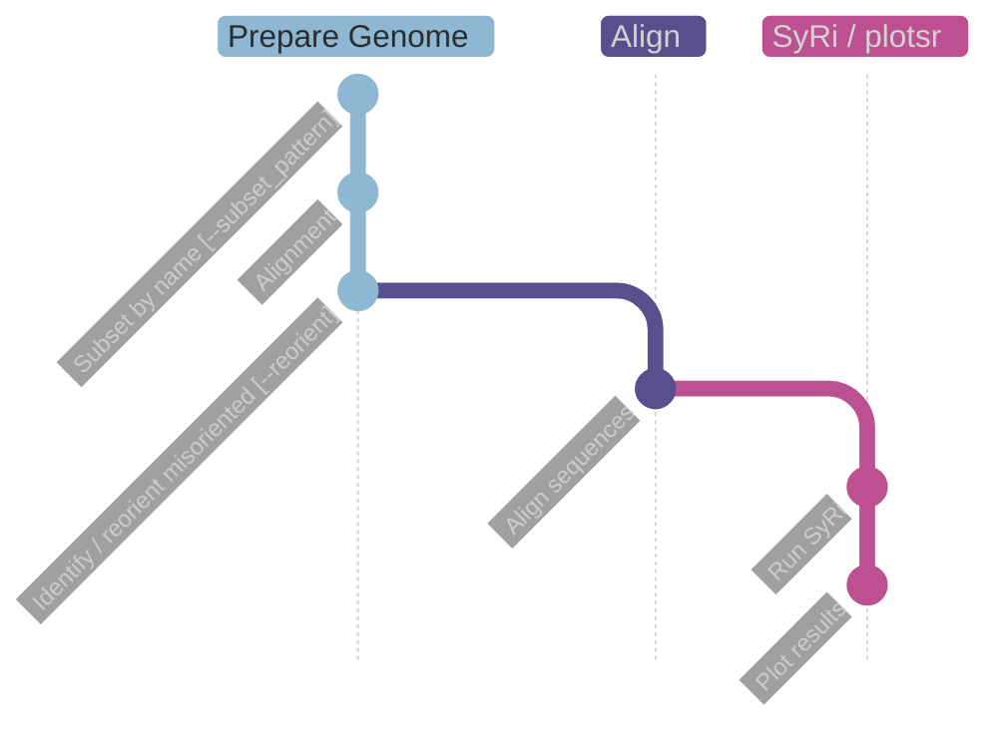

# nf-plotsv

This [`nextflow`](https://nextflow.io) pipeline can be used to analyze genomes using [`syri`](https://schneebergerlab.github.io/syri/) and [`plotsr`](https://github.com/schneebergerlab/plotsr/). Whole genome alignments are created using minimap2, oriented and re-alinged if needed, and then passed to syri and then to plotsr.


# Usage

After cloning into `$HOME` this pipeline can be run locally with `conda` environments like this:

```
nextflow run ~/nf-plotsv --samplesheet samplesheet.csv -profile local,conda
```

Or locally with docker

```
nextflow run ~/nf-plotsv --samplesheet samplesheet.csv -profile local,docker
```

Or on biohpc_gen@LRZ using charliecloud

```
nextflow run ~/nf-plotsv --samplesheet samplesheet.csv -profile biohpc_gen,charliecloud
```

To run on other infrastructure, a matching config needs to be created (or copied from [`nf-core/configs`](https://github.com/nf-core/configs/tree/master/conf))

## Samplesheet

Samplesheet layout is 

```
name,fasta
```

Reference name can be provided using `--reference`, reference genome path is `--ref_genome`.
> Note: The reference genome needs to be prefiltered to contain the same chromsomes as those selected using `params.subset_pattern` when **not** using pairwise mode

## Params

Default params are defined in [`nextflow.config`](nextflow.config):

| Parameter | Effect | Default |
|  ---  |  ---   |   ---   |
| samplesheet | Samplesheet to be used | `false` |
| reference  | Reference Name | `'Col-CEN_v1.2'` |
| ref_genome | Referemce genome fasta | `'/dss/dsslegfs01/pn73so/pn73so-dss-0000/becker_common/reference_genomes/Arabidopsis/Col-CEN/Col-CEN_v1.2.fasta'` |
| reorient | Reorient sequences to have them all go the same direction? | `false` |
| pairwise | Use pairwise mode (see below) | `true` |
| subset_pattern | Pattern used for subsetting genomes in samplesheet | `"Chr[1-5]"` |
| out | Directory for results | `'./'` |
| plotsr_conf | Config file for plotsr | `"$projectDir/assets/plotsr_config.conf"` |
| plotsr_args | Extra arguments for plotsr | `'-S 0.7 -W 5 -H 5 -f 12'` |
| plotsr_tracks | path to tracks file for plotsr, see [here](https://github.com/schneebergerlab/plotsr/blob/master/README.md#visualising-tracks). | `''` |
| plotsr_colors | Color palette to use. | [alphabet palette](https://kwstat.github.io/pals/reference/discrete.html) |


> plotsr_tracks needs to be a full path, e.g. something like "$PWD/tracks.txt" should work.

> plotsr_colors need to be provided as hex, see nextflow.config

### Pairwise mode

`--pairwise`: create consecutive pairwise alignments from the samplesheet to create a plot across many genomes.
This will create pairwise alignments from top to bottom of the samplesheet (i.e. align row2 on row1, row3 on row2, row4 on row3, etc) and then create a _single_ plot using plotsr.

### plotsr

`plotsr` is controlled via a config file. Defaults to the one in `assets/`

# Pipeline graph



# Software used

This pipeline uses the following packages:

 - [`minimap2`](https://github.com/lh3/minimap2)

 - [`seqtk`](https://github.com/lh3/seqtk)

 - [`seqkit`](https://bioinf.shenwei.me/seqkit/)

 - [`syri`](https://schneebergerlab.github.io/syri/)
 
 - [`fixchr`](https://github.com/schneebergerlab/fixchr)

 - [`plotsr`](https://github.com/schneebergerlab/plotsr)

# Cite
- Goel, M., Sun, H., Jiao, WB. et al. SyRI: finding genomic rearrangements and local sequence differences from whole-genome assemblies. Genome Biol 20, 277 (2019). https://doi.org/10.1186/s13059-019-1911-0

- Goel M, Schneeberger K. plotsr: visualizing structural similarities and rearrangements between multiple genomes. Bioinformatics. 2022 May 13;38(10):2922-2926. doi: 10.1093/bioinformatics/btac196

- Li H. Minimap2: pairwise alignment for nucleotide sequences. Bioinformatics. 2018 Sep 15;34(18):3094-3100. doi: 10.1093/bioinformatics/bty191

- Shen W, Le S, Li Y, Hu F. SeqKit: A Cross-Platform and Ultrafast Toolkit for FASTA/Q File Manipulation. PLoS One. 2016 Oct 5;11(10):e0163962. doi: 10.1371/journal.pone.0163962